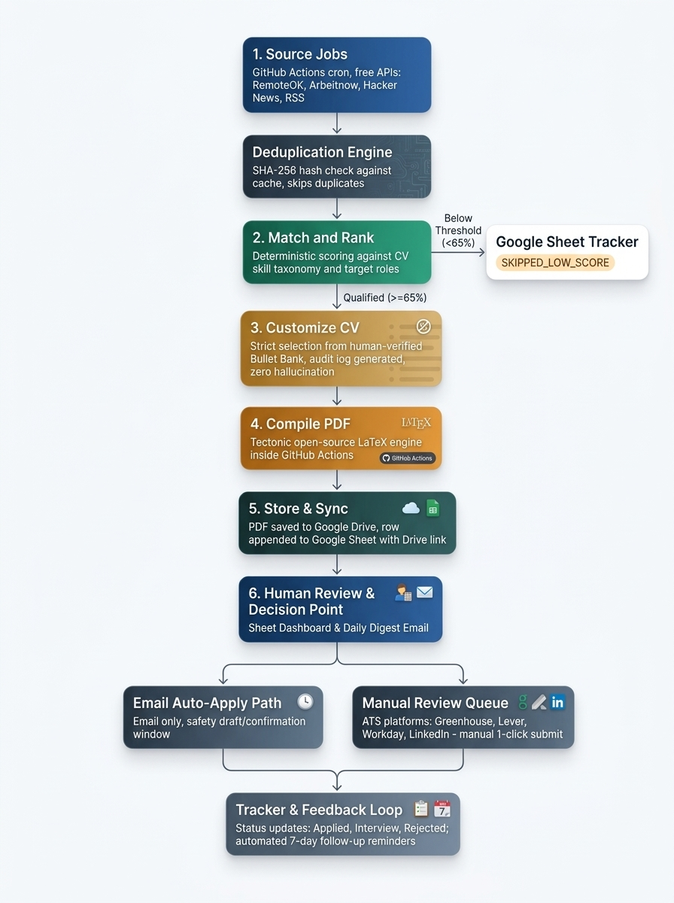

# Autonomous Job Search Pipeline & Tailored CV Engine

[](https://www.python.org/downloads/)
[](https://tectonic-typesetting.github.io/)
[](https://github.com/features/actions)
[](LICENSE)
[](#core-principles)

An end-to-end, zero-cost, autonomous job search and application pipeline. It ingests 550+ fresh developer postings daily from public APIs, filters and deduplicates them using rolling TTL caching, scores them against custom seniority gates (junior/entry-level/max 1 year experience), selects truthful project bullets from an immutable bank, compiles strictly **1-page ModernCV LaTeX PDFs**, logs data in real time to Google Sheets via webhooks, and routes applications to Gmail drafts or an ATS review queue.

---

## Architecture



### The 7-Stage Pipeline

1. **Multi-Source Ingestion**: Ingests fresh postings from public APIs and RSS feeds without paid scrapers:
   - **LinkedIn BD**: Real-time junior/entry-level tech roles in **Dhaka, Bangladesh** via public guest endpoints.
   - **WeWorkRemotely**: Dedicated worldwide remote programming roles via official RSS.
   - **Jobicy, RemoteOK, Arbeitnow**: Worldwide remote developer listings.
2. **Deduplication Engine**: Hashes postings with SHA-256 and maintains a self-cleaning **30-day rolling TTL cache** (`data/processed_cache.json`) to prevent bloat while allowing natural re-evaluations of re-posted jobs.
3. **Match & Rank Engine**: Evaluates job descriptions with multi-tier scoring (Title, Skills, Synergy, Junior Bonus) and enforces **4 Strict Hard Gates**:
   - *Gate 1: Negative Keywords* (security clearance, US citizen only, unpaid).
   - *Gate 2: Seniority Level* (hard-rejects Senior, Lead, Staff, Principal, Manager, III/IV).
   - *Gate 3: Experience Gate* (hard-rejects positions demanding $> 1$ year of experience).
   - *Gate 4: Location & Remote Gate* (all international positions must be strictly remote; local **Dhaka, Bangladesh** roles can be on-site, hybrid, or remote and receive a **+15% priority score bonus** placed at the front of the queue).
4. **Tailored CV Builder**: Uses an immutable bullet bank (`data/bullet_bank.yaml`) to match and select the candidate's genuine projects and skills. **Zero LLM hallucinations or fabricated credentials.**
5. **LaTeX PDF Compiler**: Renders a clean ModernCV template and compiles it into a pixel-perfect, strict 1-page PDF using the high-performance **Tectonic** engine.
6. **Real-Time Cloud Sync**: Records all evaluations into `data/applications.csv` and dispatches live webhooks to Google Apps Script to upload the PDF to **Google Drive**, return a shareable Drive link, and log the row into **Google Sheets**.
7. **Dual Routing**:
   - **Email Applications**: Generates customized pitch drafts saved locally and synced into Gmail ready for 1-click review and send with PDF attached.
   - **ATS Applications**: Appends direct application URLs and matched CV paths to `output/pending_review.md` and Google Sheets for 1-click manual submission.

---

## Project Structure

```text
job-search/
├── architecture/
│   └── refined_architecture.png     # High-contrast pipeline architecture diagram
├── data/
│   ├── profile.yaml                 # SINGLE SOURCE OF TRUTH: User profile, targets, skills, weights
│   ├── bullet_bank.yaml             # Immutable verified projects, experience, and education
│   ├── applications.csv             # Local tracking database of all processed jobs
│   └── processed_cache.json         # 30-day self-cleaning rolling TTL deduplication cache
├── src/
│   ├── sourcing/
│   │   ├── models.py                # Pydantic Job model with auto SHA-256 & email detection
│   │   ├── duplicator.py            # Deduplication manager with auto 30-day TTL pruning
│   │   └── fetchers/                # Modular fetchers (LinkedIn BD, WeWorkRemotely, Jobicy, RemoteOK, Arbeitnow)
│   ├── ranking/
│   │   └── matcher.py               # Multi-tier matcher with 4 hard gates and Dhaka priority
│   ├── cv_builder/
│   │   ├── selector.py              # Relevant bullet & project selector
│   │   ├── latex_escaper.py         # Jinja2 LaTeX escaping utilities
│   │   └── renderer.py              # ModernCV Jinja2 template renderer
│   ├── compiler/
│   │   └── tectonic.py              # Automated Tectonic CLI / pdflatex compiler
│   ├── storage/
│   │   └── tracker.py               # Local CSV logging + live Google Apps Script webhook sync
│   ├── routing/
│   │   └── router.py                # Dual router: email draft creator + ATS review markdown
│   └── main.py                      # Pipeline orchestrator
├── templates/
│   └── moderncv_classic_blue.tex.j2 # Strict 1-page ModernCV template
├── scripts/
│   ├── clear_cache.py               # Cache & application log reset utility for fresh runs
│   └── gmail_draft_sync.gs          # Google Apps Script for Sheet webhook, Drive links & Gmail drafts
├── tests/
│   └── test_flow.py                 # Full integration test suite & cache tests
├── .github/workflows/
│   └── job_pipeline.yml             # Scheduled daily GitHub Actions workflow (01:00 UTC / 7:00 AM BST)
├── requirements.txt
└── .env.example
```

---

## Full Setup Guide

Follow these steps to configure the pipeline for your own background and target roles.

### 1. Prerequisites

- **Python 3.10+** (Python 3.11 or 3.13 recommended)
- **Git**
- **LaTeX Compiler**: [Tectonic](https://tectonic-typesetting.github.io/) is recommended because it automatically downloads missing LaTeX packages on the fly.
  - **Windows**:
    ```powershell
    # Via winget
    winget install Tectonic.Tectonic
    # Or via cargo
    cargo install tectonic
    ```
    *Alternatively, install [MikTeX](https://miktex.org/) and ensure `pdflatex` is in your PATH.*
  - **macOS**:
    ```bash
    brew install tectonic
    ```
  - **Linux (Ubuntu/Debian)**:
    ```bash
    curl --proto '=https' --tlsv1.2 -fsSL https://drop-sh.fullyjustified.net | sh
    sudo mv tectonic /usr/local/bin/
    ```

---

### 2. Clone and Install Dependencies

```bash
git clone https://github.com/saiefadnan/job-crawler.git
cd job-crawler

# Create and activate a virtual environment
python -m venv venv
# On Windows:
venv\Scripts\activate
# On Linux/macOS:
source venv/bin/activate

# Install dependencies
pip install -r requirements.txt
```

---

### 3. Start Fresh: Reset Cache & Application History (Recommended for New Users)

When you clone this repository, `data/processed_cache.json` and `data/applications.csv` may contain previously evaluated job hashes and application logs from the original developer's runs. 

Because the deduplication engine ignores previously processed jobs, you should clear the cache so the pipeline crawls and evaluates **all** active job postings from scratch:

```bash
# Full reset: resets processed_cache.json, resets applications.csv, and cleans output/
python scripts/clear_cache.py

# Or via the main module:
python -m src.main --clear-cache
```

> **Tip**: If you only want to clear the deduplication cache while keeping your historical `applications.csv` log intact, pass `--cache-only`:
> ```bash
> python scripts/clear_cache.py --cache-only
> # Or:
> python -m src.main --clear-cache --cache-only
> ```

---

### 4. Customize Your Profile (`data/profile.yaml`)

**This file is the single configuration hub.** You do not need to modify any Python code to adapt this system to yourself.

Open `data/profile.yaml` and update the following sections:

```yaml
candidate:
  name: "Your Full Name"
  title: "Software Engineer"
  email: "your.email@example.com"
  phone: "+1 555-0199"
  location: "Your City, Country"
  linkedin: "https://linkedin.com/in/yourprofile"
  github: "https://github.com/yourusername"
  portfolio: "https://yourportfolio.com"

# Roles to search and match
target_roles:
  - "Software Engineer"
  - "Frontend Engineer"
  - "Full Stack Engineer"
  - "Junior Developer"

# Seniority and Experience Filter
experience_filter:
  max_years: 1 # Maximum years of experience required (hard rejects anything above)
  target_seniority: # Boosts score by +15% if found
    - "junior"
    - "entry"
    - "associate"
    - "fresh graduate"
    - "intern"
  disallowed_seniority: # Hard rejects jobs containing these terms
    - "senior"
    - "sr."
    - "lead"
    - "principal"
    - "staff"
    - "architect"

# Skills and weights
skills:
  primary:
    - "react"
    - "node.js"
    - "typescript"
    - "python"
  secondary:
    - "docker"
    - "postgresql"
    - "mongodb"

weights:
  title: 0.35
  skills: 0.40
  synergy: 0.15
  junior_bonus: 0.15
  threshold: 65.0 # Minimum score (%) required to generate a tailored CV
```

---

### 5. Provide Your Authentic Experiences (`data/bullet_bank.yaml`)

Edit `data/bullet_bank.yaml` with your genuine education, work history, and portfolio projects.

Each project should include:
- `name`: Project title
- `technologies`: List of tools and languages
- `keywords`: Normalized tags (e.g. `react`, `node.js`, `websockets`, `postgresql`) used by the selector to pick the top matching projects
- `bullets`: Exact descriptions of what you built and achieved

> **Note**: The pipeline selects your best-fitting projects based on job keywords and renders them into the ModernCV template. It will **never** fabricate projects, metrics, or technologies not present in this bank.

---

### 6. Defining & Customizing Your CV Template

The pipeline renders your tailored CV using a Jinja2-powered LaTeX template located in the `templates/` directory.

#### Selecting Your Active Template:
You can specify the active template directly in `data/profile.yaml`:
```yaml
cv_template: "moderncv_classic_blue.tex.j2" # Filename inside templates/
```

#### Jinja2 LaTeX Syntax:
Because LaTeX relies heavily on curly braces `{}` (e.g. `\section{...}`, `\textbf{...}`), the template engine uses custom delimiters to avoid syntax collisions:
- **Variables**: `\VAR{candidate.name}` or `\VAR{proj.name | latex_escape}`
- **Loops**: `\BLOCK{for exp in experience} ... \BLOCK{endfor}`
- **Conditionals**: `\BLOCK{if exp.bullets} ... \BLOCK{endif}`
- **Auto-Escaping Filter**: Always pipe dynamic strings through `| latex_escape` so LaTeX reserved characters (`&`, `%`, `_`, `#`, `$`, `{`, `}`) are safely escaped without crashing the compiler.

#### Available Data Variables in the Template:
The CV renderer automatically passes the following structured data into your template:

| Variable | Type | Description |
| :--- | :--- | :--- |
| `candidate` | Dict | Full profile: `name`, `title`, `email`, `phone`, `location`, `github`, `linkedin`, `portfolio` |
| `first_name`, `last_name` | String | Candidate's split first and last names |
| `education` | List[Dict] | Education entries: `degree`, `institution`, `period`, `cgpa` |
| `experience` | List[Dict] | Work experience: `role`, `company`, `period`, `location`, `bullets` |
| `projects` | List[Dict] | Top matched projects (tailored to job keywords): `name`, `tech_stack`, `bullets` |
| `cp` | Dict | Competitive programming stats: `solved_count`, `platforms`, `highlights` |
| `certifications` | List[str] | List of certifications |

#### ModernCV Styles & Colors:
The default template (`templates/moderncv_classic_blue.tex.j2`) uses the clean `moderncv` package:
- **Themes**: Switch `\moderncvstyle{classic}` to `casual`, `banking`, `oldstyle`, or `fancy`.
- **Colors**: Switch `\moderncvcolor{blue}` to `orange`, `green`, `red`, `purple`, `grey`, or `black`.

#### Strict 1-Page Layout Guarantee:
To guarantee the output never overflows onto a second page:
- Geometry margins: `\usepackage[scale=0.93, top=0.8cm, bottom=0.8cm, left=1.0cm, right=1.0cm]{geometry}`
- Compact itemize lists: `\usepackage{enumitem}` with `\setlist[itemize]{leftmargin=*, nosep, topsep=1pt, itemsep=0.5pt}`
- Hint column width: `\setlength{\hintscolumnwidth}{2.7cm}`
- Page numbers suppressed: `\nopagenumbers{}`

#### How to Add a New Custom Template:
1. Duplicate the base template:
   ```bash
   cp templates/moderncv_classic_blue.tex.j2 templates/my_custom_cv.tex.j2
   ```
2. Modify layout, section order, or typography in `templates/my_custom_cv.tex.j2`.
3. Set your new template in `data/profile.yaml`:
   ```yaml
   cv_template: "my_custom_cv.tex.j2"
   ```

---

### 7. Setup Google Sheets, Google Drive & Gmail Cloud Sync

The pipeline features a zero-cost cloud sync mechanism connecting Python with your personal Google Drive, Google Sheets, and Gmail using a lightweight Google Apps Script endpoint.

#### How It Works:
- **Automatic Google Drive Upload (Local or Cloud)**: When running either locally or in headless CI (GitHub Actions), Python base64-encodes each compiled 1-page CV PDF and transmits it via the webhook. The script automatically creates/finds a `Job_CVs` folder in your Google Drive, saves the PDF, sets shareable view permissions, and records the `drive_link` in your Google Sheet.
- **Automated Gmail Draft Generation**: For qualified jobs accepting email applications (`apply_method == 'email'`), the script automatically calls `GmailApp.createDraft()`. It creates a ready-to-send draft in your Gmail account with the customized cover pitch, candidate signature, and the tailored CV PDF attached.

#### Step-by-Step Setup:
1. Create a new [Google Sheet](https://sheets.new).
2. Click **Extensions > Apps Script**.
3. Delete any boilerplate code and paste the entire contents of [`scripts/gmail_draft_sync.gs`](scripts/gmail_draft_sync.gs).
4. Click **Deploy > New deployment**:
   - Select type: **Web app**
   - Description: `Job Tracker Webhook`
   - Execute as: **Me**
   - Who has access: **Anyone** *(Required so Python on your PC or GitHub Actions can post without OAuth prompt)*
5. Click **Deploy**, authorize permissions with your Google account, and copy the provided **Web App URL** (`https://script.google.com/macros/s/.../exec`).
6. Set your local `.env` file:
   ```bash
   cp .env.example .env
   ```
7. Open `.env` and paste your URL:
   ```env
   GOOGLE_SHEET_WEBHOOK_URL="https://script.google.com/macros/s/YOUR_DEPLOYMENT_ID/exec"
   ```

*(If left blank, the pipeline runs in offline mode, logging exclusively to local `data/applications.csv` and saving PDFs in `output/tailored_cvs/`.)*

#### Graceful Local Fallback (Local-First Architecture):
The pipeline is strictly **Local-First and Fault-Tolerant**:
- **100% Persisted Locally First**: Every tailored CV PDF (`output/tailored_cvs/`), email pitch draft (`output/email_drafts/`), ATS review item (`output/pending_review.md`), and tracking record (`data/applications.csv`) is written to local disk **before** any network call is attempted.
- **Graceful Cloud Failure Handling**: If `GOOGLE_SHEET_WEBHOOK_URL` is omitted, your network connection drops, or Google services experience timeouts/outages, the pipeline automatically catches the error, outputs a safe warning, and continues uninterrupted. No jobs or PDFs are ever lost.
- **Manual Catch-Up Sync**: If you run offline or during a network outage, you can import `data/applications.csv` into your Google Sheet anytime later, upload your local PDFs into the `Job_CVs` folder in Google Drive, and run `generateDriveLinksAndSync()` in Apps Script to backfill all Drive links and create Gmail drafts in one click.

---

### 8. Run the Pipeline Locally

Run the pipeline from your terminal:

```bash
python -m src.main
```

#### Handy CLI Commands:

| Command | Description |
| :--- | :--- |
| `python -m src.main` | Runs full crawl, scoring, CV compilation, and cloud sync. |
| `python scripts/clear_cache.py` | Resets `data/processed_cache.json`, clears `data/applications.csv`, and empties `output/`. |
| `python -m src.main --clear-cache` | Convenient flag to trigger full cache reset directly from the main module. |
| `python scripts/clear_cache.py --cache-only` | Clears deduplication cache only without modifying your application history log. |
| `python -m src.main --clear-cache --cache-only` | Runs cache-only reset directly from `src.main`. |
| `pytest tests/ -v` | Runs the full integration test suite. |

When execution completes, check the generated artifacts:
- **`output/tailored_cvs/`**: Tailored 1-page ModernCV PDF for each qualified match.
- **`output/email_drafts/`**: Personalized email pitch files for email-based applications.
- **`output/pending_review.md`**: Markdown digest with 1-click apply links for ATS systems (Greenhouse, Lever, LinkedIn).
- **`data/applications.csv`**: Local tracking log of every job evaluated, its score, reason, and status.
- **`data/processed_cache.json`**: Updated 30-day rolling deduplication cache.
- **Google Sheet & Gmail**: If configured, new rows appear instantly in your Sheet with Drive links, and email drafts appear in your Gmail Drafts folder.

---

### 9. Automated Daily Runs via GitHub Actions (Cloud Execution)

You do **not** need to keep your computer running. The repository includes a GitHub Actions workflow (`.github/workflows/job_pipeline.yml`) configured to run daily at 9:00 AM BST (03:00 UTC) (or manually triggered via 1-click `workflow_dispatch`).

#### How Google Drive Saves CVs When Not Running Locally:
1. **Remote PDF Compilation**: On the headless GitHub Actions runner (Ubuntu), Tectonic compiles each tailored 1-page ModernCV.
2. **Direct Cloud Transmission**: `ApplicationTracker` reads the compiled PDF bytes, encodes them in base64, and POSTs them inside the JSON payload to your Google Apps Script webhook.
3. **Google Drive Storage**: Google Apps Script receives the payload, saves the file directly into your personal Google Drive (`Job_CVs`), and generates a public view link (`drive_link`).
4. **Gmail Draft with Attachment**: If the role accepts email applications, Google Apps Script attaches the PDF directly to a draft in your Gmail inbox.
5. **Workflow Artifact Archive**: In addition, GitHub Actions archives all generated PDFs as a downloadable zip artifact (`tailored-cvs-<run_id>`) under the **Actions** tab (retained for 14 days).

#### Enabling GitHub Actions:
1. Push your repository to GitHub (public or private).
2. Navigate to **Settings > Secrets and variables > Actions**.
3. Click **New repository secret**:
   - **Name**: `GOOGLE_SHEET_WEBHOOK_URL`
   - **Value**: Your Google Apps Script Web App URL
4. Under the **Actions** tab, click **Daily Automated Job Search Pipeline** > **Run workflow** to test execution.

---

### 10. Handling Applications: Your Daily Workflow

Once the pipeline runs (either locally or on schedule in GitHub Actions):

#### Branch A: Email Applications (Gmail Drafts)
1. Open your regular Gmail (web or mobile).
2. Go to your **Drafts** folder.
3. You will see pre-populated drafts addressed to recruiter emails with:
   - Customized subject line: `Application: [Job Title] - [Your Name]`
   - Tailored pitch highlighting your matching skills and authentic projects.
   - Your compiled 1-page ModernCV PDF attached.
   - Clickable Google Drive fallback link in the body.
4. Review the draft (10 seconds), make any personal tweaks, and hit **Send**.

#### Branch B: ATS Applications (1-Click Queue)
1. Open `output/pending_review.md` (or your Google Sheet).
2. Each qualified role includes:
   - Company & Job Title
   - Direct Apply URL (Greenhouse, Lever, Workday, LinkedIn)
   - Path to your tailored 1-page CV PDF (or clickable Google Drive link)
3. Click the application link, upload your tailored CV, and submit.


---

## Running Tests

Run the full suite of integration tests (verifying seniority gates, CV compilation, routing, and cache TTL):

```bash
pytest tests/ -v
```

---

## Automated 30-Day Rolling Cleanup (Zero Storage Bloat)

To ensure the pipeline runs forever without exceeding local disk space or free cloud storage quotas, an automated **30-day self-cleaning retention policy** runs on every execution across all 6 storage layers:

| Layer | Storage Location | Retention Policy | Purpose |
| :--- | :--- | :--- | :--- |
| **Deduplication Cache** | `data/processed_cache.json` | Pruned after 30 days | Prevents hash bloat; allows reposted jobs to be naturally re-evaluated. |
| **Local Application Log** | `data/applications.csv` | Pruned after 30 days | Keeps local CSV tracking lean and fast without manual maintenance. |
| **Local Artifacts** | `output/` (PDFs, TeX, drafts) | Pruned after 30 days | Automatically deletes old compiled CVs, LaTeX logs, and email drafts. |
| **Google Drive** | `Job_CVs/` folder | Trashed after 30 days | Protects your free 15 GB Google Drive storage quota. |
| **Google Sheets** | Applications Sheet rows | Deleted after 30 days | Keeps your job tracker sheet responsive and focused on active leads. |
| **Gmail Inbox** | Gmail Drafts | Deleted after 30 days | Automatically cleans stale, un-sent job drafts older than 30 days. |

> **Automation**: Every execution of `python -m src.main` triggers both local cleanup (`prune_local_records`, `prune_local_files`) and remote cloud cleanup (`run30DayCleanup` via webhook). You can also run `run30DayCleanup` manually or set a recurring time-driven trigger in Google Apps Script.

---

## Core Principles

- **Zero Fabrication**: No LLMs generating fake accomplishments. The CV builder only uses verified facts from `data/bullet_bank.yaml`.
- **Zero Cost**: Built entirely on free public APIs, open-source LaTeX tools, Google Apps Script, and free GitHub Actions tiers.
- **Zero ATS Auto-Submit**: Respects company application rules. Web/ATS jobs are staged in `output/pending_review.md` for 1-click human review and manual submission.
- **Seniority Protected**: Protects early-career candidates from wasting time on Senior/Staff roles while optimizing matching for Junior and Entry-level positions.

---

## License

This project is licensed under the MIT License.
