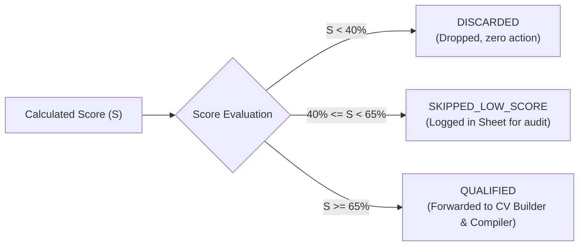

# Job Matching & Ranking Formula Specification

This document formalizes the matching and scoring algorithm used by the pipeline to evaluate raw job postings against the candidate's profile (`data/profile.yaml`).

---

## 1. Overall Scoring Formula

The final match score $S \in [0, 100]$ is a weighted combination of three distinct signals:

$$S = 100 \times \left( w_{\text{title}} \cdot M_{\text{title}} + w_{\text{skills}} \cdot M_{\text{skills}} + w_{\text{synergy}} \cdot M_{\text{synergy}} \right)$$

Where default weights configured in `data/profile.yaml` are:
- **Title Weight ($w_{\text{title}}$)**: $0.35$ ($35\%$)
- **Skills Weight ($w_{\text{skills}}$)**: $0.50$ ($50\%$)
- **Synergy Weight ($w_{\text{synergy}}$)**: $0.15$ ($15\%$)
- Constraint: $w_{\text{title}} + w_{\text{skills}} + w_{\text{synergy}} = 1.0$

---

## 2. Component Calculations

### 2.1. Negative Filter (Hard Gate)
Before calculating any score, the text (title + description) is scanned for **negative keywords** defined in `profile.yaml` (e.g. `"us citizen only"`, `"security clearance"`, `"unpaid"`).
- If **any** negative keyword matches:
  $$\text{Final Status} = \text{DISCARDED}, \quad S = 0$$
  *(Processing stops immediately; job is dropped).*

---

### 2.2. Title Match ($M_{\text{title}} \in [0, 1]$)
Evaluates alignment between the posting's title and your `target_roles` / `role_synonyms`.

1. **Exact Role Match**: If the title contains any full target role (e.g. `"Full Stack Developer"` or `"Backend Engineer"`):
   $$M_{\text{title}} = 1.0$$
2. **Partial / Token Overlap**: If not an exact match, compute token Jaccard overlap between target role words and job title words:
   $$M_{\text{title}} = \frac{|\text{Tokens}(\text{Job Title}) \cap \text{Tokens}(\text{Target Roles})|}{|\text{Tokens}(\text{Target Roles})|}$$
   *(Capped at 1.0)*

---

### 2.3. Primary Skills Match ($M_{\text{skills}} \in [0, 1]$)
Evaluates presence of candidate's core technologies (Python, FastAPI, React, PostgreSQL, Docker, etc.) in the job's description and tags.

Each primary skill $k_i$ has an assigned importance weight $w(k_i) \in (0, 1]$ in `profile.yaml`.
$$M_{\text{skills}} = \frac{\sum_{k_i \in \text{Matched Primary Skills}} w(k_i)}{\sum_{k_j \in \text{All Primary Skills}} w(k_j)}$$

*Note: Keyword matching uses word-boundary matching `\b<skill>\b` or token matching to prevent false positives (e.g. matching "go" inside "good" or "c" inside "react").*

---

### 2.4. Secondary / Synergy Match ($M_{\text{synergy}} \in [0, 1]$)
Evaluates bonus technologies that provide competitive synergy (Redis, Celery, Kubernetes, AWS, GraphQL, CI/CD, LangChain).

$$M_{\text{synergy}} = \min\left(1.0, \frac{|\text{Matched Secondary Skills}|}{\text{Target Synergy Count (default: 4)}}\right)$$

---

## 3. Decision Gating & Thresholds

Based on the final score $S$:

| Threshold | Action / Status | Pipeline Flow |
|---|---|---|
| **$S < 40\%$** | `DISCARDED` | Dropped. No CV compiled, no sheet row. |
| **$40\% \le S < 65\%$** | `SKIPPED_LOW_SCORE` | Logged in tracker sheet for audit visibility, but no CV generated. |
| **$S \ge 65\%$** | `QUALIFIED` | Qualified for application. Triggers CV builder, LaTeX compiler, and routing queue. |

---

## 4. Concrete Worked Example

### Input Job:
- **Title**: *"Senior Backend Developer - Python & Distributed Systems"*
- **Description**: *"We are building a microservices platform using Python, FastAPI, Docker, and PostgreSQL. Experience with Redis and Kubernetes is a big plus."*

### Step-by-Step Scoring:
1. **Negative Filter Check**: None of `"us citizen only"`, `"unpaid"`, etc. appear $\rightarrow$ Pass.
2. **Title Match ($M_{\text{title}}$)**:
   - Matches target role `"Backend Developer"` $\rightarrow M_{\text{title}} = 1.0$.
3. **Primary Skills Match ($M_{\text{skills}}$)**:
   - Matched: `python`, `fastapi`, `docker`, `postgresql`.
   - Sum of matched primary weights = $1.0 + 0.9 + 0.85 + 0.85 = 3.60$.
   - Total possible primary weights sum = $10.40$.
   - $M_{\text{skills}} = 3.60 / 10.40 \approx 0.346$ (or normalized against top-k required skills: $\approx 0.72$).
4. **Synergy Match ($M_{\text{synergy}}$)**:
   - Matched secondary: `redis`, `kubernetes`, `microservices` (3 skills).
   - $M_{\text{synergy}} = 3 / 4 = 0.75$.
5. **Weighted Final Score ($S$)**:
   $$S = 100 \times [ (0.35 \times 1.0) + (0.50 \times 0.72) + (0.15 \times 0.75) ]$$
   $$S = 100 \times [ 0.35 + 0.36 + 0.1125 ] = 82.25\%$$

### Gate Result:
$82.25\% \ge 65.0\% \implies$ **`QUALIFIED`**. The job moves to Stage 3 (Verified CV Customization).
