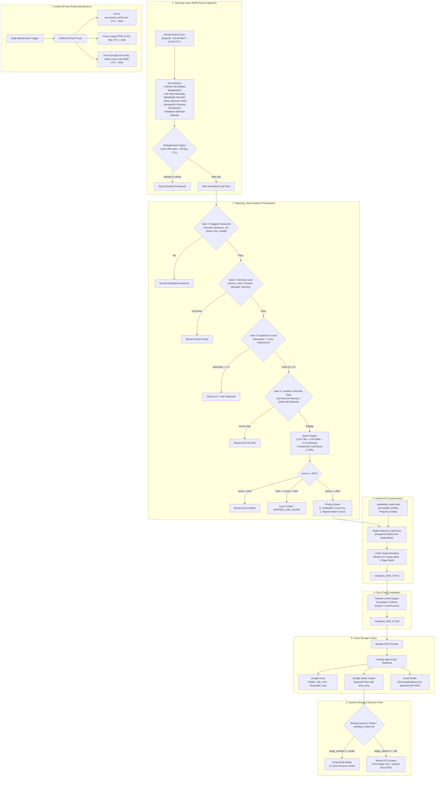

# Refined Pipeline Architecture

This document formalizes the refined zero-cost job pipeline architecture based on the reviewed design.

---

## 1. Pipeline Flowchart (Mermaid)

---

## 2. Google Sheet State Machine & Lifecycle

The Google Sheet acts as both the **central inbox** and the **long-term tracker**:

| Status | Trigger | Meaning | Next Action Required |
|---|---|---|---|
| `SKIPPED_LOW_SCORE` | Match score $40\% - 64\%$ | Logged for auditing and visibility. | No action required. |
| `DISCARDED` | Match score $<40\%$ or negative filter hit | Ignored. | No action required. |
| `PENDING_REVIEW` | Score $\ge 65\%$ and ATS / Web portal | Ready for manual submission. | Click Job URL, upload the Drive PDF, submit form, change status to `APPLIED`. |
| `EMAIL_QUEUED` | Score $\ge 65\%$ and plain company email | Ready for email application. | Review generated email draft & CV attachment, send, change status to `APPLIED`. |
| `APPLIED` | Manually marked after applying | Application has been submitted. | Triggers the 7-day follow-up reminder clock. |
| `FOLLOW_UP_DUE` | `Date Applied + 7 days <= Today` | No response after 1 week. | Apps Script flags row in morning digest to send a polite follow-up. |
| `INTERVIEW` | Recruiter reaches out | Progressing in interview rounds. | Log interview stages and notes. |
| `REJECTED` | Rejection received | Outcome logged. | Closes loop. |
| `GHOSTED` | 30+ days without response | Archived. | Closes loop. |

---

## 3. Key Architectural Boundaries

1. **Deduplication Boundary**:
   - Computes `SHA256(source + ":" + company + ":" + title + ":" + url)`.
   - Checks against `data/processed_cache.json`.
   - Never makes unnecessary scoring or compilation calls on repeated daily runs.
2. **Immutability Boundary**:
   - `data/bullet_bank.yaml` is the single source of truth.
   - Built-in assertion checks verify that every bullet in the rendered CV exists verbatim in the verified bullet bank.
3. **ATS Protection Boundary**:
   - Zero scraping or automated form submissions against Workday, Greenhouse, Lever, or LinkedIn Easy Apply.
   - Always provides direct job links and ready-made PDFs for 1-click human submission.
4. **Free-Tier Limits Boundary**:
   - Tectonic compiles in GitHub Actions runners (0 local dependencies, 0 paid licenses).
   - Apps Script manages Drive and Sheet storage with a single daily morning digest email (conserving email quotas).

---

## 4. Ranking & Scoring Formula Summary

For detailed mathematics and a worked calculation, see [docs/ranking_formula.md](file:///e:/my_projects/job-search/docs/ranking_formula.md).

$$\text{Final Score } S = 100 \times \left( 0.35 \cdot M_{\text{title}} + 0.50 \cdot M_{\text{skills}} + 0.15 \cdot M_{\text{synergy}} \right)$$

- **Hard Gate**: If any negative keyword matches $\rightarrow \text{DISCARDED} (S = 0\%)$.
- **Thresholds**:
  - $S < 40\%$: `DISCARDED` (Dropped from pipeline).
  - $40\% \le S < 65\%$: `SKIPPED_LOW_SCORE` (Logged in Sheet, no CV built).
  - $S \ge 65\%$: `QUALIFIED` (Proceeds to Stage 3: CV Customization).

